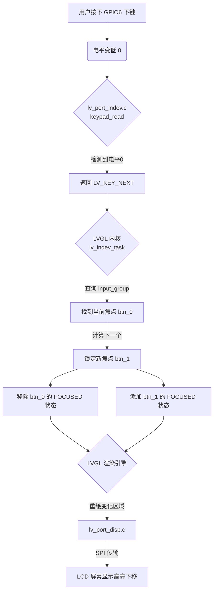

这两个问题非常核心，触及了 LVGL 乃至大多数 GUI 框架的**底层设计哲学**。我来为你详细拆解。

---

### 问题一：中间节点（容器）与叶子节点（控件）的区别

在 LVGL 中，其实**所有的 UI 元素本质上都是 `lv_obj_t`**。所谓的“容器”和“叶子节点”只是我们在逻辑上的分类，它们的区别主要体现在**功能职责**和**布局行为**上。

#### 1. 核心区别对比表

| 特性 | 中间节点 (Container/Panel) | 叶子节点 (Button/Label) |
| :--- | :--- | :--- |
| **主要职责** | **“管理”**：负责把子对象排好队、定好位。 | **“表现”**：负责显示内容或响应用户点击。 |
| **是否有子对象** | **有**。它是父级，肚子里装着别的对象。 | **通常没有**。它是末梢，虽然技术上也能塞东西，但一般不这么做。 |
| **布局影响** | **决定者**。它的 Flex/Grid 属性决定了孩子怎么排。 | **服从者**。它的大小和位置受父亲（容器）的约束。 |
| **视觉表现** | 通常是背景色、边框、或者干脆透明（只做占位用）。 | 具体的图标、文字、颜色变化、按下效果。 |
| **代码示例** | `lv_obj_create(scr)` <br> `lv_obj_set_flex_flow(...)` | `lv_label_create(btn)` <br> `lv_btn_create(list)` |

#### 2. 具体表现是什么样的？

想象一个**书架（容器）**和**书（叶子节点）**的关系：

*   **容器 (Container)**：就像你代码里的 `list_cont`。
    *   它本身可能只是一个透明的框。
    *   它的任务是告诉里面的按钮：“你们要垂直排列，每个之间间隔 5 像素，宽度占满我。”
    *   如果你把容器删了，里面的按钮就会失去坐标参考，乱成一团或者消失。
*   **叶子节点 (Leaf)**：就像你代码里的 `btn` 和 `label`。
    *   `btn` 是一个可以点击的区域。
    *   `label` 是贴在按钮上的一行字。
    *   它们不关心其他按钮在哪，只关心自己在这个容器里排第几。

**在你的代码中：**
```c
lv_obj_t * list_cont = lv_obj_create(scr); // 这是一个容器（中间节点）
lv_obj_set_flex_flow(list_cont, LV_FLEX_FLOW_COLUMN); // 容器定义了规则：孩子们竖着排

lv_obj_t * btn = lv_btn_create(list_cont); // 这是一个叶子节点（但在逻辑上它又是 label 的父亲）
lv_obj_t * label = lv_label_create(btn);   // 这是一个纯粹的叶子节点
```
*注意：在 LVGL 中，`Button` 既是叶子（相对于容器），又是父亲（相对于标签）。这种层级嵌套是 GUI 的灵魂。*

---

### 问题二：按下“向下键”时，数据是怎么走的？

这是一个非常精彩的**“硬软结合”**过程。当你按下开发板上的物理按键（比如 GPIO6 对应的下键）时，整个系统会经历以下 5 个步骤：

#### 第一步：硬件层 —— 电平变化 (GPIO)
1.  你按下了 GPIO6 的按键。
2.  引脚电平从 **高电平 (1)** 变为 **低电平 (0)**。
3.  此时 CPU 的寄存器里记录了这一变化。

#### 第二步：驱动层 —— 轮询与翻译 ([lv_port_indev.c](file://f:\Cursor\ESP32_s3\wifi\components\BSP\lvgl\lv_port_indev.c))
LVGL 有一个后台任务（通常在 `lv_timer_handler` 中），它会不停地问你的驱动：“现在有按键吗？”
1.  **调用读取函数**：LVGL 调用你在 `lv_port_indev_init` 里注册的 `keypad_read` 函数。
2.  **获取键值**：
    *   `keypad_read` 内部调用 `keypad_get_key()`。
    *   `gpio_get_level(KEY_DOWN_GPIO)` 返回 `0`。
    *   `keypad_get_key` 识别出这是 `LV_KEY_NEXT`（下一个）。
3.  **上报状态**：
    *   `data->state = LV_INDEV_STATE_PR;` (告诉 LVGL：键被按下了)
    *   `data->key = LV_KEY_NEXT;` (告诉 LVGL：是“下一个”键)

#### 第三步：内核层 —— 输入设备处理 ([lv_indev.c](file://f:\Cursor\ESP32_s3\wifi\managed_components\lvgl__lvgl\src\core\lv_indev.c))
LVGL 内核收到 `LV_KEY_NEXT` 后，开始查找这个按键属于哪个“组”。
1.  **寻找焦点组**：它发现这个按键设备绑定到了 `input_group`（你在 [ui.c](file://f:\Cursor\ESP32_s3\wifi\components\BSP\ui\ui.c) 里创建的那个组）。
2.  **查找当前焦点**：它查看 `input_group` 里，现在谁正处在“聚光灯”下？假设现在是第一个 WiFi 按钮 `btn_0`。
3.  **执行导航逻辑**：
    *   因为是 `LV_KEY_NEXT`，内核会在组的链表里找到 `btn_0` 的下一个对象 `btn_1`。
    *   如果开启了 `wrap`（循环），且 `btn_0` 是最后一个，它会跳回第一个。

#### 第四步：样式层 —— 状态切换 (Visual Feedback)
这是用户眼睛能看到变化的瞬间。
1.  **旧焦点失焦**：LVGL 把 `btn_0` 的状态从 `LV_STATE_FOCUSED` 移除。
    *   `btn_0` 的蓝色高亮框（`style_focus`）消失，变回透明背景（`style_btn`）。
2.  **新焦点聚焦**：LVGL 把 `btn_1` 的状态设为 `LV_STATE_FOCUSED`。
    *   `btn_1` 立即应用 `style_focus` 样式。
    *   **表现**：`btn_1` 的背景变成深海蓝 `#1E293B`，文字变成亮蓝 `#38BDF8`，并出现一圈蓝色轮廓线。

#### 第五步：渲染层 —— 屏幕刷新 ([lv_refr.c](file://f:\Cursor\ESP32_s3\wifi\managed_components\lvgl__lvgl\src\core\lv_refr.c) -> [lcd.c](file://f:\Cursor\ESP32_s3\wifi\components\BSP\lcd\lcd.c))
1.  **标记脏区**：LVGL 知道只有 `btn_0` 和 `btn_1` 发生了变化，它只把这两个矩形区域标记为“需要重绘”。
2.  **生成缓冲**：LVGL 在内存（RAM）里画出这两个按钮的新样子。
3.  **发送数据**：通过 SPI 接口，把这块更新后的像素数据发送给 ESP32-S3 的 LCD 屏幕。
4.  **最终呈现**：你看到屏幕上的高亮框从第一行“滑”到了第二行。

---

### 总结数据流向图



### 为什么这样设计？
这种设计的最大好处是**解耦**：
*   **写 UI 的人**（你）只需要关心：把按钮加到 `group` 里，定义好 `FOCUSED` 样式长什么样。
*   **写驱动的人**只需要关心：把 GPIO 电平翻译成 `LV_KEY_NEXT`。
*   **LVGL 内核**负责中间的桥梁工作。

所以，当你下次想增加一个“向左键”来退出页面时，你只需要在 [lv_port_indev.c](file://f:\Cursor\ESP32_s3\wifi\components\BSP\lvgl\lv_port_indev.c) 里把左键映射为 `LV_KEY_ESC`，然后在 [ui.c](file://f:\Cursor\ESP32_s3\wifi\components\BSP\ui\ui.c) 里给 group 注册一个回调函数处理 `ESC` 事件即可，完全不需要改动底层的渲染逻辑。